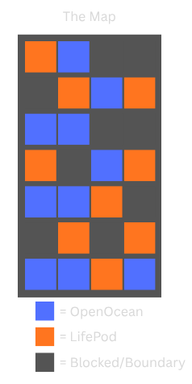
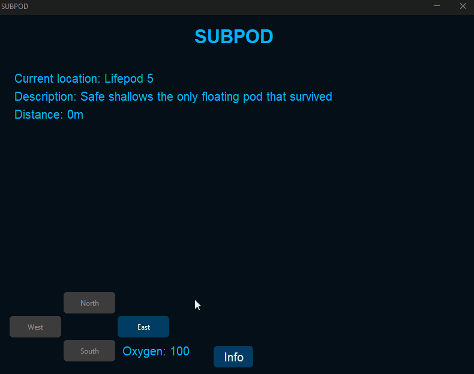
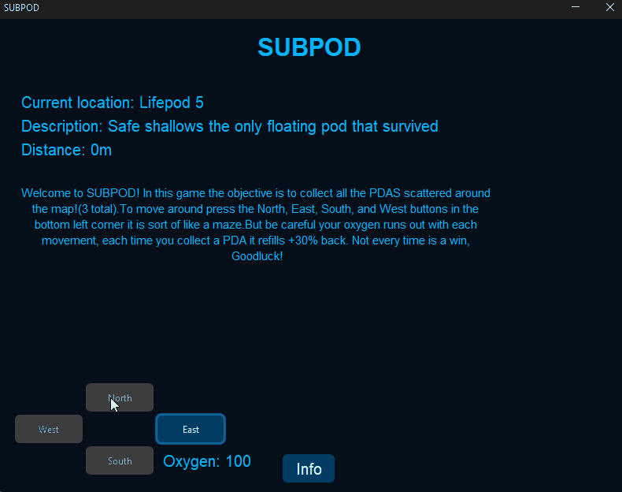
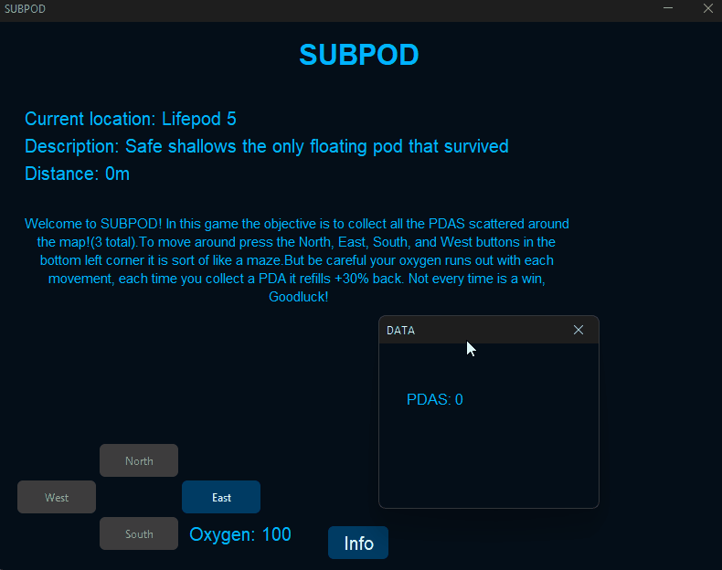
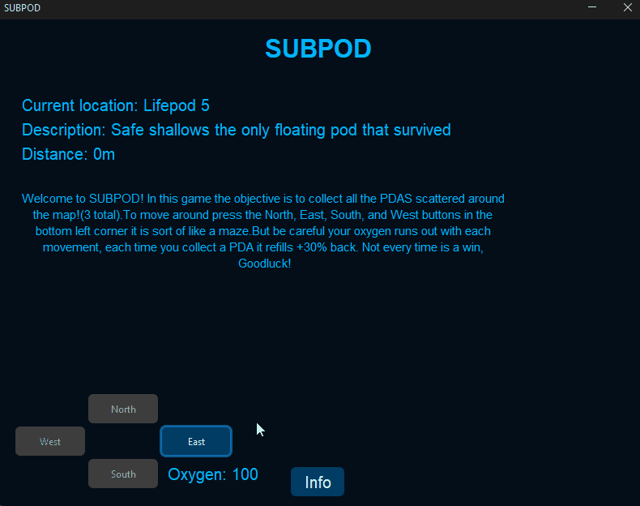

# Results of Testing

The test results show the actual outcome of the testing, following the [Test Plan](test-plan.md)

## The Map of SUBPOD:

---

## Movement - Valid

I will test to see if the player can move around the map freely

### Test Data Used

I will try to move North, East, South, and west around the map

### Test Result

As you can see the game lets me move north, east, south, and west

---

## Map Boundary - Boundary

I will test the map boundaries to stop the player from moving out the map

### Test data Used

I will try go past all the edges of the map by moving the player to each side and try going North, East, South, and West

### Test Result

When I go to the edge of each side of my map the button disables and acts like a blocked path

---

## PDA collection - Valid

I will test to see if PDAS are randomly spawning in diferent lifepods each game and that when the user collects one

### Test data Used

I will try a couple games to see if the PDAS are in new spots

### Test Result

As you can see I start the game with 0 PDAS and as I move to the first lifepod it adds 1 PDA lucky me. After I restart
the game
I go back to having 0 PDAS and move to the same spot as before but I didn't get a PDA until I moved to the next lifepod.

---

## Oxygen Draining - Valid

I will test to see if oxygen drains with each movement

### Test data Used

I will try moving in each direction to see if the oxygen drains with each movement all by the same amount

### Test Result

As the gif shows I start with 100 oxygen and it drains with each movement by 5 in each direction

